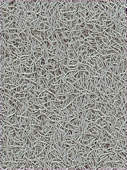
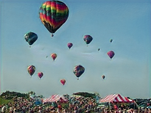

# SinGAN: Learning a Generative Model from a Single Natural Image

## Overview

This repository contains a simplified implementation of the SinGAN model, which is capable of learning a generative model from a single natural image. The code has been updated to be compatible with PyTorch 2.2 and has been refactored for improved readability.

SinGAN is a generative model that can learn the internal statistics of a single image. The model is able to generate high-quality diverse samples, as well as perform various image manipulation tasks, such as super-resolution, paint-to-image, and harmonization.

## Paper

SinGAN: Learning a Generative Model from a Single Natural Image  
Authors: Tamar Rott Shaham, Tali Dekel, Tomer Michaeli  
[arXiv:1905.01164](https://arxiv.org/abs/1905.01164)

## Features

- Single-image training
- Multi-scale pyramid of GANs
- Diverse and high-quality image generation
- Image manipulation tasks

## Requirements

- Python 3.8 or higher
- PyTorch 2.2
- NumPy
- Pillow
- Matplotlib

You can install the required packages using:

```bash
pip install -r requirements.txt
```

## Usage

### Training

To train the SinGAN model on a single image, use the following command:

```bash
python main.py --input_name path/to/image.jpg --num_scales 8 --epochs 2000
```

### Generation

To generate images using the trained model, use:

```bash
python random_sample.py --input_name path/to/image.jpg --num_samples 10
```

## Code Structure

- `main.py`: Script for training the SinGAN model.
- `random_sample.py`: Script for generating images from the trained model, put the same parameters as the trained model.

## Example Results

Texture input                          |  Balloons input
:-------------------------------------:|:----------------------------------:
      |  
Texture output                         |         Balloons output
  |  

## Acknowledgements

This implementation is based on the original SinGAN paper and its supplementary materials. Special thanks to the authors for their groundbreaking work.

---
